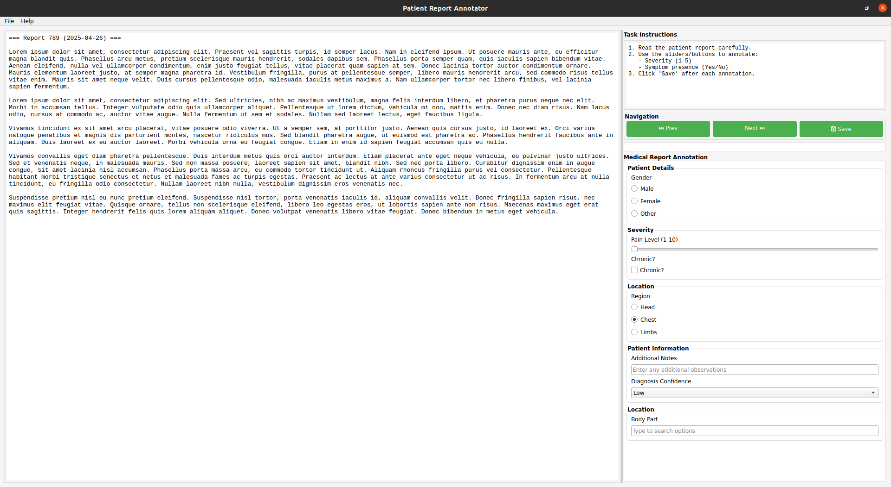
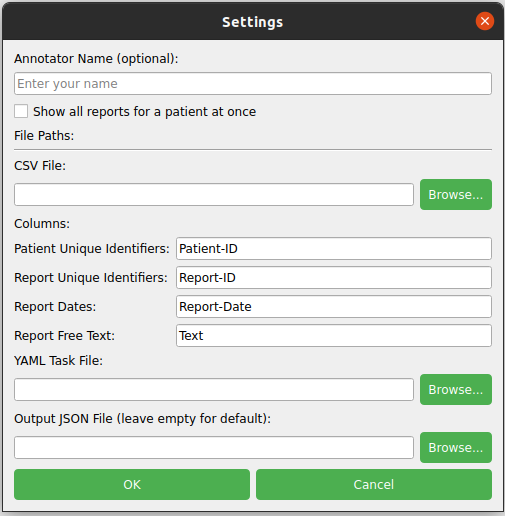
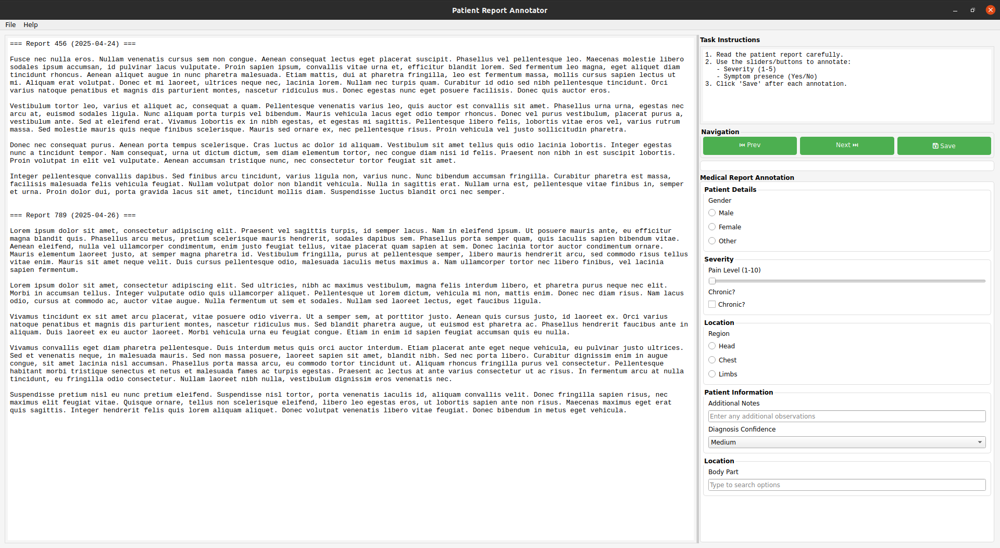
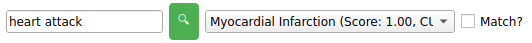

# Patient Report Annotator - User Guide

## Interface Overview

The application has three main areas:

1. **Left Panel**: Displays the patient report text(s)
2. **Right Panel - Top**: Shows task instructions
3. **Right Panel - Bottom**: Contains the annotation controls



### Navigation Controls
- **Prev/Next**: Move between reports or patients (`Ctrl+←`/`Ctrl+→`)
- **Save**: Save current annotations and move to next unannotated item (`Ctrl+S`)
- **Progress Bar**: Shows your completion status

### Menu Options
- **File → Settings**: Change input files or preferences
- **File → Save to CSV**: Export annotations in CSV format
- **Help → About**: View application information

<div style="page-break-after: always;"></div>

## Settings

Configure application behavior through:

- **Annotator Name**: Optional identifier for your work
- **View Mode**:
  - ☑ Show all reports for a patient at once ([Group Mode](#group-mode-vs-single-report-mode))
  - ☐ Show single reports (Default Mode)
- **File Paths**:
  - CSV: Patient reports data file
      - *Column Headers*: Select your CSV columns to expected fields (default options displayed)
  - [YAML](#configuring-the-ui): Annotation task definition
  - [JSON](#automatic-saving): Where to save annotations 



Access via: **File → Settings** or `Ctrl+O`

<div style="page-break-after: always;"></div>

## Annotation Workflow

1. **Read the report text** in the left panel
2. **Review the instructions** in the top right panel
3. **Complete all annotation fields** in the bottom right panel
4. **Click Save** to store your annotations or `Ctrl+S`
5. **Move to the next report** using the Next button (`Ctrl+→`) or Save button (`Ctrl+S`)

## Group Mode vs. Single Report Mode

### Single Report Mode (default)
- Shows one report at a time
- Each report gets independent annotations
- Best for focused annotation tasks

### Group Mode (enable in Settings)
- Shows all reports for a patient together
- Applies same annotations to all reports
- Ideal for reviewing patient history



<div style="page-break-after: always;"></div>

## UMLS Concept Linking

For medical concept standardization:

1. Enter a term (e.g., "heart attack")
2. Click search button (🔍)
3. Select from suggested concepts
4. Confirm with "Match?" checkbox

Example UMLS results:
1. Myocardial Infarction (Score: 1.00, CUI: C0027051)
2. Heart Attack (Score: 0.95, CUI: C0027051)
3. Acute MI (Score: 0.90, CUI: C0027051)



## Saving and Exporting

### Automatic Saving
- Annotations save to JSON when:
  - Clicking Save 
  - Changing settings
  - Closing application
  - `Ctrl+S`

### CSV Export
1. Go to **File → Save to CSV** or `Ctrl+E`
2. Choose location
3. File will contain:
   - All annotation fields
   - Patient/report IDs
   - Timestamps
   - Annotator name

<div style="page-break-after: always;"></div>

## Configuring the UI

The annotation interface is configured through a YAML file that defines:
- Task instructions
- Grouping of related questions
- All input control types and their options

So for your task you will need to create your own YAML configuration file.

### Basic Structure:
```yaml
name: "Your Task Name"
instructions: "Detailed instructions for annotators..."
groups:
  - label: "Section 1"
    controls: [...]
  - label: "Section 2" 
    controls: [...]
```

### Annotation Control Types

The application supports several input types:

| Control Type   | Description                | Example Use               | YAML Example |
|----------------|----------------------------|----------------------------|--------------|
| Checkbox       | Simple yes/no option       | "Present/Absent" findings  | <pre><code>- label: "Malignant"<br> <t> type: "checkbox"<br>  required: true</code></pre> |
| Radio Buttons  | Single selection           | Gender selection           | <pre><code>- label: "Gender"<br>  type: "radio"<br>  options: ["Male", "Female", "Other"]</code></pre> |
| Slider         | Numeric value within range | Confidence level (0-100)   | <pre><code>- label: "Confidence"<br>  type: "slider"<br>  min: 0<br>  max: 100<br>  default: 50</code></pre> |
| Text Field     | Free text input            | Additional notes           | <pre><code>- label: "Comments"<br>  type: "text"<br>  placeholder: "Enter notes..."</code></pre> |
| Dropdown       | Predefined options         | Diagnosis categories       | <pre><code>- label: "Diagnosis"<br>  type: "dropdown"<br>  options: ["AML", "ALL", "CML"]</code></pre> |
| Autocomplete   | Text with suggestions      | Medication names           | <pre><code>- label: "Medication"<br>  type: "autocomplete"<br>  options: ["Aspirin", "Ibuprofen", ...]</code></pre> |
| Date Picker    | Calendar date selection    | Event date                 | <pre><code>- label: "Onset Date"<br>  type: "date"</code></pre> |
| UMLS Mapper    | Medical concept linking    | Standardized diagnoses     | <pre><code>- label: "Diagnosis"<br>  type: "text"<br>  mapper: true</code></pre> |

<div style="page-break-after: always;"></div>

### Advanced Configuration Options:

1. **Collapsible Sections:** Usefull when having large sections, or different questions for specific use-cases.
```yaml
- label: "Advanced Findings"
  collapsible: true
  initially_expanded: false
  controls: [...]
```
2. **Default Values:** Will show this initially and save default if not changed
```yaml
- label: "Status"
  type: "dropdown"
  options: ["Active", "Resolved", "Chronic"]
  default: "Active"
```
3. **Required Fields:** Upon saving will check if these field are filled in, and if not throw a reminder
```yaml
- label: "Primary Diagnosis"
  type: "text"
  required: true
```

<div style="page-break-after: always;"></div>

### Example Complete Configuration:

```yaml
name: "Oncology Report Annotation"
instructions: "Annotate tumor characteristics and treatment details..."

groups:
  - label: "Patient Demographics"
    controls:
      - label: "Age at Diagnosis"
        type: "slider"
        min: 0
        max: 120
        
      - label: "Gender"
        type: "radio"
        options: ["Male", "Female", "Other"]
        required: true

  - label: "Tumor Characteristics"
    collapsible: true
    controls:
      - label: "Primary Site"
        type: "text"
        mapper: true
        required: true
        
      - label: "Stage"
        type: "dropdown"
        options: ["I", "II", "III", "IV"]
```

### Tips

1. Start with simple controls and add complexity gradually
2. Use collapsible sections for detailed annotations
3. Test your YAML file after each major change
4. Maintain consistent indentation (2 spaces recommended)
5. (Bonus cheat) Use an LLM like chatGPT and provide this documentation, one of the example yaml and a wish list (i.e. what you would like to annotate). It often does a good job generating a suitable yaml configuration file. 

<div style="page-break-after: always;"></div>

## Troubleshooting

### Common Issues

1. UMLS search not working:
    - First search will download required data (may take several minutes)
    - Ensure you have an internet connection
    - Check console for error messages

2. CSV file not loading:
    - Verify column headers match your settings
    - Check for special characters or formatting issues
    - Ensure date fields are in recognizable formats

3. Annotations not saving:
    - Check if output file location is writable
    - Verify you have permission to write to the directory

For additional support, contact: [BIGR Group](https://bigr.nl)